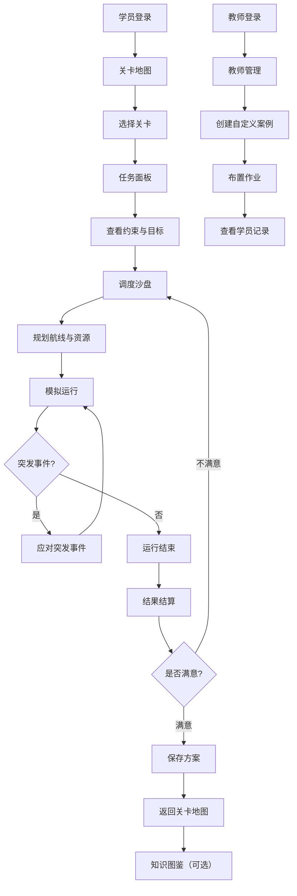

## 1. 产品概述

植保无人机航线调度仿真教学游戏，面向农林院校和培训机构，让学生在接近真实的任务约束下学习如何科学安排航线与调度资源，而非仅练习手动飞行。产品通过游戏化关卡设计，覆盖水稻、果园、丘陵、零散地块等典型作业场景，融入天气变化、突发事件、预算管理等真实约束，培养学生系统化的调度思维与决策能力。

## 2. 核心功能

### 2.1 用户角色

| 角色 | 注册方式 | 核心权限 |
|------|----------|----------|
| 学员 | 教师分配账号或自助注册 | 游玩关卡、查看知识图鉴、对比历史方案 |
| 教师 | 管理员分配账号 | 布置自定义案例作业、查看学员调度记录、管理关卡 |

### 2.2 功能模块

1. **关卡地图**：展示所有可玩关卡的场景缩略图与星级进度，按难度分区排列
2. **任务面板**：展示当前关卡的任务约束（面积、药剂、天气、时限）与突发事件
3. **调度沙盘**：核心交互区，玩家在地图上为不同机型分配航线、设置补给节奏、调配资源
4. **结果结算**：展示亩效、准点率、安全分、成本分，给出调度建议与星级评定
5. **知识图鉴**：解释常见调度错误与典型作业策略，作为学习参考

### 2.3 页面详情

| 页面名称 | 模块名称 | 功能描述 |
|----------|----------|----------|
| 关卡地图 | 场景分区导航 | 按水稻/果园/丘陵/零散地块分区展示关卡列表 |
| 关卡地图 | 关卡卡片 | 显示场景缩略图、名称、难度标签、已获星级 |
| 关卡地图 | 整体进度面板 | 展示总星级/完成率、当前段位 |
| 任务面板 | 任务约束卡片 | 显示面积、药剂限量、天气变化、交付时限 |
| 任务面板 | 机型信息面板 | 展示可用机型的载重、续航、速度、喷幅参数 |
| 任务面板 | 天气预报条 | 时间轴展示未来天气变化趋势 |
| 任务面板 | 突发事件预告 | 提示可能出现的阵风、人群、道路封闭、临时加单 |
| 任务面板 | 星级目标面板 | 展示1-3星的达成条件 |
| 调度沙盘 | 作业地图画布 | 可交互的田块地图，支持缩放与平移 |
| 调度沙盘 | 航线绘制工具 | 点击田块边缘设定起降点，拖拽绘制航线 |
| 调度沙盘 | 机型分配面板 | 为每条航线分配机型，显示载重与续航匹配度 |
| 调度沙盘 | 补给点设置 | 在地图上标记电池/药剂补给位置与节奏 |
| 调度沙盘 | 实时警告系统 | 实时标红重复喷洒、漏喷区域和危险穿越路径 |
| 调度沙盘 | 预算与资源面板 | 显示剩余预算，购买备用电池或增派飞手 |
| 调度沙盘 | 时间轴控制 | 模拟运行/暂停/加速，观察调度执行过程 |
| 调度沙盘 | 突发事件弹窗 | 运行中随机触发阵风、人群闯入等事件，需即时应对 |
| 结果结算 | 综合评分雷达图 | 展示亩效、准点率、安全分、成本分四维评分 |
| 结果结算 | 调度建议面板 | 指出不合理的转场路线、过长的等待时间等 |
| 结果结算 | 星级评定动画 | 1-3星点亮动画与评语 |
| 结果结算 | 方案保存按钮 | 保存当前调度方案至历史记录 |
| 结果结算 | 重试/下一关按钮 | 重新挑战或进入下一关卡 |
| 知识图鉴 | 调度错误图鉴 | 图文解释重复喷洒、漏喷、危险穿越等常见错误 |
| 知识图鉴 | 作业策略图鉴 | 展示典型作业策略如梳式航线、蚁群覆盖等 |
| 知识图鉴 | 机型参数对比 | 不同机型参数对比表与应用场景推荐 |
| 知识图鉴 | 天气影响说明 | 各天气条件对作业的影响量化说明 |
| 教师管理 | 自定义案例编辑器 | 教师创建自定义关卡，设定地块、约束与目标 |
| 教师管理 | 学员记录查看 | 查看各学员历史调度方案与评分趋势 |
| 教师管理 | 作业布置面板 | 将自定义案例作为作业分配给指定学员 |

## 3. 核心流程

学员进入关卡地图选择关卡 → 进入任务面板查看约束与目标 → 进入调度沙盘规划航线与资源 → 点击模拟运行观察执行过程 → 应对突发事件 → 运行结束后进入结果结算 → 查看评分与建议 → 保存方案或重试 → 退出后可查看知识图鉴学习策略

教师登录 → 进入教师管理 → 创建自定义案例 → 布置作业给学员 → 查看学员提交记录与评分对比

## 4. 用户界面设计

### 4.1 设计风格

- **主色调**：深绿（#1B5E20）+ 金黄（#F9A825）农林主题色，搭配浅米色（#FFF8E1）背景
- **辅助色**：天蓝色（#0288D1）表示航线，红色（#D32F2F）表示警告，橙色（#EF6C00）表示突发事件
- **按钮风格**：圆角矩形（8px），微立体阴影效果，主按钮深绿底白字，次按钮描边风格
- **字体**：标题使用 ZCOOL XiaoWei（站酷小薇体）体现农林质朴感，正文使用 Noto Sans SC 保证可读性
- **布局风格**：左侧固定导航栏 + 右侧内容区，卡片式布局，地图区域最大化
- **图标风格**：线性图标搭配微填充，使用农业/航空主题图标集
- **动画风格**：航线绘制时流动光点效果，评分时数字翻滚上升，星级点亮逐颗弹出

### 4.2 页面设计概览

| 页面名称 | 模块名称 | UI元素 |
|----------|----------|--------|
| 关卡地图 | 场景分区导航 | 顶部标签切换，深绿底色带纹理，激活标签金黄色下划线 |
| 关卡地图 | 关卡卡片 | 圆角卡片，场景缩略图占上半部，底部显示名称+星级+难度标签，悬浮时卡片上浮+阴影加深 |
| 关卡地图 | 整体进度面板 | 右侧固定面板，圆形进度条+段位徽章，渐变色进度 |
| 任务面板 | 任务约束卡片 | 4列网格卡片，每张带图标+数值，深色半透明背景 |
| 任务面板 | 机型信息面板 | 横向滚动卡片组，每张卡片展示机型3D简图+参数条 |
| 任务面板 | 天气预报条 | 横向时间轴，天气图标+渐变色段，晴天绿/雨天蓝/大风橙 |
| 任务面板 | 突发事件预告 | 黄色警告条，脉冲闪烁动画，图标+文字描述 |
| 任务面板 | 星级目标面板 | 3行目标列表，每行左侧星级图标+右侧达标条件文字 |
| 调度沙盘 | 作业地图画布 | 居中大区域Canvas，深色背景，田块用绿色色块+边界线，支持缩放平移 |
| 调度沙盘 | 航线绘制工具 | 左侧垂直工具栏，选中工具高亮，鼠标跟随航线预览线 |
| 调度沙盘 | 机型分配面板 | 右侧折叠面板，下拉选择机型，匹配度进度条（绿/黄/红） |
| 调度沙盘 | 补给点设置 | 地图上拖拽放置补给图标，面板显示补给节奏配置 |
| 调度沙盘 | 实时警告系统 | 右下角浮动通知，红色闪烁标记地图问题区域 |
| 调度沙盘 | 预算与资源面板 | 底部水平条，预算进度条+购买按钮组 |
| 调度沙盘 | 时间轴控制 | 底部播放控制栏，播放/暂停/倍速按钮+进度条 |
| 调度沙盘 | 突发事件弹窗 | 居中模态框，橙色边框，倒计时+应对选项按钮 |
| 结果结算 | 综合评分雷达图 | 居中SVG雷达图，四轴分别标注，填充区域渐变色 |
| 结果结算 | 调度建议面板 | 左侧列表，每条建议带图标+描述+关联区域高亮链接 |
| 结果结算 | 星级评定动画 | 居中大号星级，逐颗点亮+光晕扩散动画 |
| 结果结算 | 方案保存按钮 | 底部绿色主按钮，保存时脉冲反馈 |
| 知识图鉴 | 调度错误图鉴 | 左侧分类导航+右侧图文卡片，错误示意动画 |
| 知识图鉴 | 作业策略图鉴 | 策略卡片组，每张包含动画演示+文字说明 |
| 教师管理 | 自定义案例编辑器 | 全屏编辑器，左侧地块绘制画布+右侧参数配置面板 |

### 4.3 响应式设计

- 桌面优先设计，最小支持1280px宽度
- 调度沙盘地图区域在宽屏下最大化，1920px以上增加侧面板宽度
- 平板端（768-1280px）侧面板折叠为抽屉式
- 移动端不作为主要适配目标，但保证基本可用性

### 4.4 3D场景指引（不适用）

本产品为2D仿真，不涉及3D场景。
