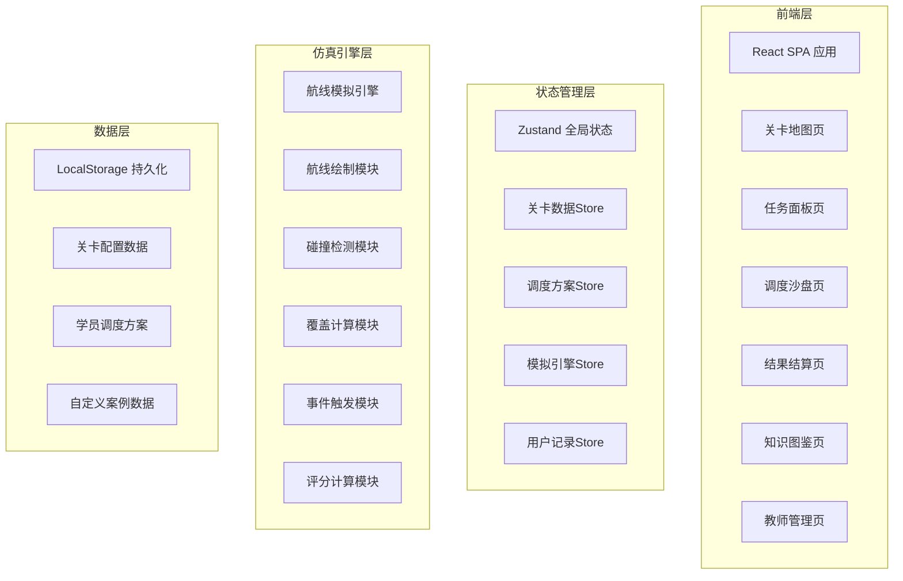
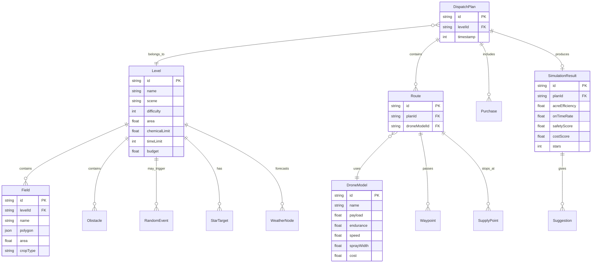

## 1. 架构设计



## 2. 技术说明

- **前端框架**：React@18 + TypeScript
- **样式方案**：Tailwind CSS@3
- **构建工具**：Vite
- **状态管理**：Zustand（轻量级全局状态管理）
- **地图渲染**：HTML5 Canvas（调度沙盘核心渲染引擎）
- **动画库**：Framer Motion（UI动画与过渡效果）
- **图表**：自定义SVG雷达图（结果结算评分展示）
- **后端**：无后端，全部数据存储在 LocalStorage
- **数据库**：无数据库，使用JSON数据文件初始化关卡配置

## 3. 路由定义

| 路由 | 用途 |
|------|------|
| `/` | 关卡地图主页，展示所有可玩关卡 |
| `/mission/:id` | 任务面板，展示指定关卡的任务约束与目标 |
| `/dispatch/:id` | 调度沙盘，核心交互页面，规划航线与调度资源 |
| `/result/:id` | 结果结算，展示评分、建议与星级评定 |
| `/encyclopedia` | 知识图鉴，调度错误与作业策略学习 |
| `/teacher` | 教师管理面板，创建案例与查看学员记录 |

## 4. API定义（无后端）

所有数据通过前端状态管理与LocalStorage交互：

### 4.1 核心数据类型

```typescript
interface Level {
  id: string;
  name: string;
  scene: 'paddy' | 'orchard' | 'hillside' | 'scatter';
  difficulty: 1 | 2 | 3 | 4 | 5;
  area: number;
  chemicalLimit: number;
  weatherTimeline: WeatherNode[];
  timeLimit: number;
  starTargets: StarTarget[];
  fields: Field[];
  obstacles: Obstacle[];
  events: RandomEvent[];
  budget: number;
}

interface DroneModel {
  id: string;
  name: string;
  payload: number;
  endurance: number;
  speed: number;
  sprayWidth: number;
  cost: number;
}

interface Route {
  id: string;
  droneModelId: string;
  waypoints: Waypoint[];
  supplyPoints: SupplyPoint[];
  targetFields: string[];
}

interface DispatchPlan {
  id: string;
  levelId: string;
  routes: Route[];
  purchases: Purchase[];
  timestamp: number;
  result?: SimulationResult;
}

interface SimulationResult {
  acreEfficiency: number;
  onTimeRate: number;
  safetyScore: number;
  costScore: number;
  stars: 1 | 2 | 3;
  suggestions: Suggestion[];
  overlapAreas: OverlapArea[];
  missedAreas: MissedArea[];
}

interface WeatherNode {
  time: number;
  type: 'sunny' | 'cloudy' | 'rainy' | 'windy' | 'storm';
  windSpeed: number;
  windDirection: number;
}

interface RandomEvent {
  id: string;
  type: 'gust' | 'crowd' | 'road_closed' | 'rush_order';
  triggerTime: number;
  duration: number;
  description: string;
  affectedArea?: Polygon;
}

interface StarTarget {
  stars: 1 | 2 | 3;
  conditions: { metric: string; threshold: number }[];
}
```

## 5. 服务器架构图（无后端）

本项目为纯前端应用，无服务器架构。所有数据存储在浏览器LocalStorage中。

## 6. 数据模型

### 6.1 数据模型定义



### 6.2 数据初始化

项目内置6个预设关卡数据（JSON格式），覆盖水稻、果园、丘陵、零散地块四种场景：

1. **新手水稻田**（难度1）：规则矩形地块，无天气变化，无突发事件
2. **果园防虫**（难度2）：行距较窄的果树地块，轻度风力影响
3. **丘陵梯田**（难度3）：高差变化地块，阵风干扰，需多次补给
4. **零散地块组**（难度4）：多块分散小田，道路封闭事件，航线转场优化
5. **暴风雨抢收**（难度5）：天气急剧变化，临时加单，预算紧张
6. **综合挑战**（难度5+）：所有约束叠加，需极致调度优化

机型数据预设4种：
- 小型多旋翼：载重10L，续航20min，速度5m/s，喷幅3m
- 中型多旋翼：载重16L，续航25min，速度6m/s，喷幅4m
- 大型多旋翼：载重25L，续航18min，速度4m/s，喷幅5m
- 油动直升机：载重40L，续航40min，速度8m/s，喷幅6m
